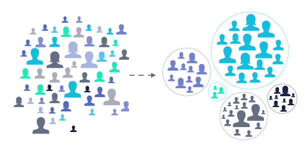

 
# Customer Segmentation
A case study of a retailer to understand the behavior of customers.

## The Dataset:

This project made use of the E-Commerce Data an actual transactions from UK retailer, found here: https://www.kaggle.com/carrie1/ecommerce-data.

<table>
  <tr>
    <th>InvoiceNo</th>
    <th>StockCode</th>
    <th>Description</th>
    <th>Quantity</th>
    <th>InvoiceDate</th>
    <th>UnitPrice</th>
    <th>CustomerID</th>
    <th>Country</th>
  </tr>
</table>
 
## The Model K-Means Clustering:
The Model K-Means is a vector quantization, originally from signal processing, that aims to partition n observations into k clusters in which each observation belongs to the cluster with the nearest mean (cluster centers or cluster centroid), serving as a prototype of the cluster.

## The Result:

Cluster 0 is loyal/active customers.\n
Cluster 1 is new customers.\n
Cluster 2 is churned/old customers.
